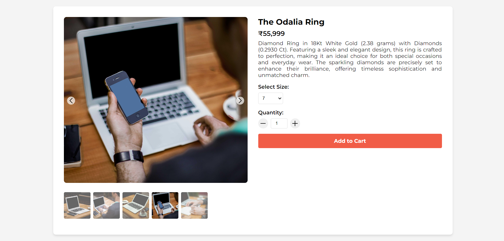
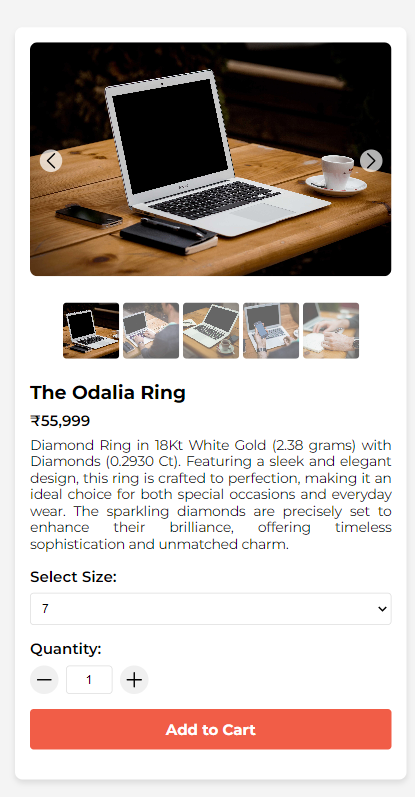

# Product Details Page

Product details page for an e-commerce website. It includes a product image carousel with thumbnails, and the product images that is fetched from an online API.

## Key Features

### 1. Dynamic Carousel
- Responsive navigation with left and right arrows
- Touch/swipe functionality for mobile devices
- Clickable thumbnail gallery

### 2. Interactive Experience
- Interactive size and quantity selector
- "Add to Cart" button with confirmation message
- Product loading screen

### 3. Responsive Design
- Mobile-first approach
- Adapts layout for different screen sizes

## Screens
### Dektop Screen

### Mobile Screen

 
